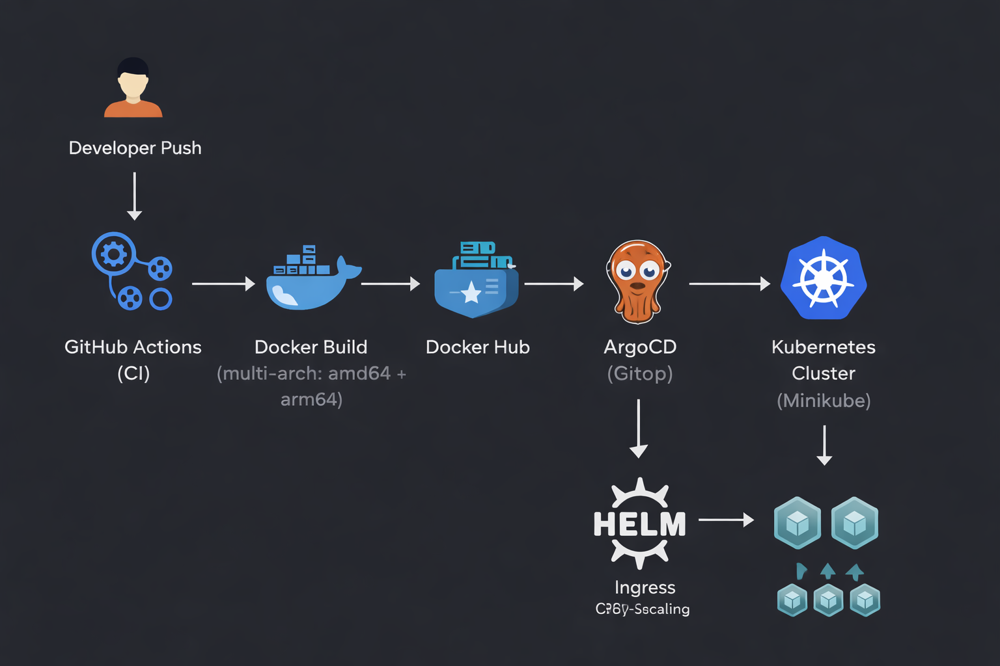

# 🚀 Cloud-Native User Service

Production-style cloud-native microservice built with **Node.js, Docker, Kubernetes, Helm, Terraform, and GitOps (ArgoCD)**.

This project demonstrates a complete DevOps lifecycle including CI automation, deterministic container versioning, Infrastructure as Code, and GitOps-based continuous deployment.

---

## 🧱 Architecture Overview

<p align="center">
  
</p>

---

## 🔄 CI/CD & GitOps Flow

```text
Developer Push
      ↓
GitHub Actions (CI)
  - Multi-arch Docker build (amd64 + arm64)
  - Tag image with commit SHA
  - Push image to Docker Hub
      ↓
GitHub Actions (CD)
  - Update image tag in values-prod.yaml
  - Commit back to repository
      ↓
ArgoCD (GitOps)
  - Detect Git change
  - Auto-sync & self-heal
      ↓
Helm
      ↓
Kubernetes Cluster
  - Rolling update
  - HPA scaling
```

No manual deployment steps are required.

---

## 🛠 Tech Stack

- Node.js (Express)
- Docker (multi-stage, multi-architecture builds)
- Kubernetes (Minikube)
- Helm
- Terraform
- ArgoCD (GitOps)
- GitHub Actions
- Docker Hub

---

## 📦 Project Structure

```text
cloud-native-user-service/
├── app/                     # Node.js application
├── user-service-chart/      # Helm chart (templated K8s manifests)
├── terraform/               # Infrastructure as Code (Helm via Terraform)
├── legacy/                  # Initial raw K8s manifests
├── docs/                    # Architecture diagrams
├── .github/workflows/       # CI/CD pipelines
└── README.md
```

---

## 🐳 Docker

- Multi-stage build
- Multi-architecture support (`linux/amd64`, `linux/arm64`)
- Commit SHA image tagging
- Automated image publishing to Docker Hub

Docker Hub repository:

`mujagicamer/cloud-native-user-service`

---

## ☸ Kubernetes Features

- Deployment with rolling updates
- Service (ClusterIP)
- NGINX Ingress
- Liveness & readiness probes
- Resource requests & limits
- Horizontal Pod Autoscaler (CPU-based)
- ConfigMap & Secret configuration
- Zero-downtime updates

---

## 📦 Helm

Application is packaged as a Helm chart with:

- Templated Kubernetes manifests
- Environment-based configuration (DEV / PROD)
- Version-controlled deployment strategy

Example commands:

```bash
helm install user-service ./user-service-chart
helm upgrade user-service ./user-service-chart
helm rollback user-service <revision>
```

---

## 🏗 Terraform

Terraform manages Helm releases and environment selection:

```bash
terraform apply -var="env=prod" -var="image_tag=<commit-sha>"
```

Features:

- Environment variable-based configuration
- Dynamic image tag injection
- Declarative infrastructure management

In production, Terraform state would typically be stored in a remote backend (e.g., S3 + DynamoDB locking).

---

## 🔁 GitOps (ArgoCD)

ArgoCD continuously monitors the repository and:

- Detects configuration changes
- Automatically syncs cluster state
- Ensures self-healing
- Prunes obsolete resources

Git is the single source of truth.

---

## 🌐 Local Development

### Start environment (after reboot)

```bash
colima start
minikube start --driver=docker
minikube service ingress-nginx-controller -n ingress-nginx
```

### Run application locally (without Kubernetes)

```bash
cd app
npm install
npm start
```

---

## 🎯 Design Decisions

### Why GitOps?
To ensure the cluster state always reflects the repository state. No manual deployments are required.

### Why SHA-based image tagging?
To guarantee deterministic deployments and enable safe rollbacks.

### Why Helm?
To manage Kubernetes resources as reusable, templated packages.

### Why Terraform?
To demonstrate Infrastructure as Code and environment-based orchestration.

---

## 🚀 What This Project Demonstrates

- End-to-end CI/CD automation
- GitOps workflow with ArgoCD
- Multi-environment configuration management
- Deterministic versioned deployments
- Kubernetes operational patterns
- Infrastructure as Code best practices
- Production-style deployment strategy

---

## 🔮 Future Improvements

- Container image security scanning (Trivy)
- Remote Terraform backend
- Observability integration (Prometheus/Grafana)
- Cloud deployment (EKS / GKE)